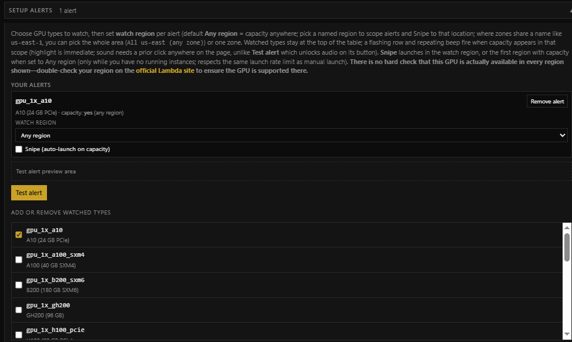
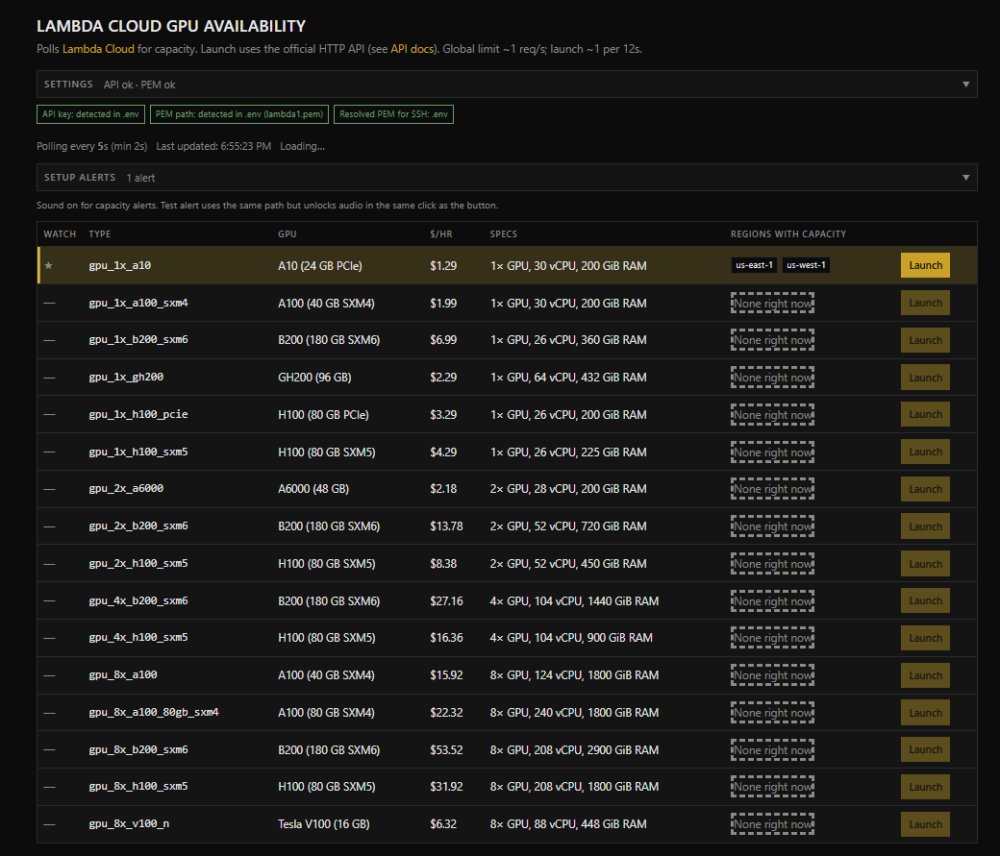

# Lambda Cloud Orchestration UI + MCP

My biggest blocker over the past few months was GPU availability. Lambda is my favorite platform because it has much less friction to setup than hyperscalers like GCP, but popular GPUs still disappear fast, and I am tired of manually refreshing a tab. This repo automates the entire GPU provisioning process and provides post-provisioning handoff to agents via MCP. The MCP exposes Lambda Cloud instances over SSH, and commands are orchestrated by [Poke](https://poke.com/) so you can agentically set up ML environments and training jobs over text message — full agency and productivity from your phone.

You provision the GPU manually through the UI first (one instance at a time, as a guardrail against runaway cloud bills). Once a GPU is up, the agent can handle everything else on the machine: raw SSH commands, environment setup, starting/stopping training, terminating the instance, and more.

## Quickstart

**Prerequisites:** Node **20+**, a [Lambda API key](https://cloud.lambda.ai/api-keys), an SSH **public** key registered in Lambda, and a local **`.pem`** matching it.

```bash
npm install
npm run setup     # guided wizard: writes a validated .env.local
npm run dev       # starts the UI and the MCP server together
```

Then open [http://localhost:3000](http://localhost:3000).

If you chose the **Poke (HTTP)** transport in the wizard, connect Poke in another terminal:

```bash
npx poke@latest tunnel http://127.0.0.1:8080/mcp -n "Local dev mcp"
```

That's it. Only two values are required (your **API key** and **`.pem` path**); everything else has sensible defaults. The wizard prints the exact next steps for your chosen transport when it finishes.

> Prefer not to use the wizard? Copy [`.env.example`](.env.example) to `.env.local` and fill in the two required vars by hand. Full variable reference: [`docs/configuration.md`](docs/configuration.md).

### Using Cursor / an editor (stdio) instead of Poke

Pick the **Cursor / editor (stdio)** option in the wizard, then run `npm run dev:ui` (UI only) and point your editor's MCP config at `npm run mcp` in this folder. See [`docs/configuration.md`](docs/configuration.md) for details.

---

## Orchestration UI

A **Next.js 16** app that polls the [Lambda Cloud HTTP API](https://docs-api.lambda.ai/api/cloud) for GPU capacity, launches instances, lists and terminates runners, with optional capacity **alerts** and **Snipe** (auto-launch), and a suggested `ssh -i` using your `.pem`. Use it to operate visually and to configure what MCP later reads over HTTP.



Set up alerts for desired GPUs. Optionally auto-provision them the moment they become available via **Snipe**. Region scopes include **Any Region**, high-level areas like **Us-East**, or a granular zone such as **`us-east-1`**.



See available GPUs in near-real-time with built-in safeguards against Lambda rate limits. When a watched GPU becomes available, rows flash and the page beeps. Launch and terminate from the same page.

All Lambda calls go through **this app's server routes**; the API key stays out of the client bundle. Optional per-session overrides for **API key** and **PEM path** live under **Settings** (sent only to this app's APIs; they do **not** apply to the MCP process).

### Behavior at a glance

- **Capacity poll:** default **5s**, minimum **2s** (Settings). Ease off if you hit rate limits (~1 req/s account-wide).
- **Pause:** fast polling stops while an instance runs or a launch is in flight. With at least one alert configured, capacity still refreshes every **45s** so alerts/Snipe can see new stock.
- **Alerts & Snipe:** watched types pin to the top; a flashing row + repeating beep fire when capacity appears in scope (sound needs a prior click anywhere, or use **Test alert**). Snipe auto-launches when watched capacity newly appears, only with no running instance and outside cooldown (~12s between attempts).
- **SSH hint:** default `ubuntu` @ port **22**; adjust if your image differs.

Watch/snipe sync between the UI and MCP, plus all tuning knobs, are documented in [`docs/configuration.md`](docs/configuration.md).

---

## MCP server

`npm run mcp` runs the server ([`src/mcp/server.ts`](src/mcp/server.ts)). On startup it validates that `LAMBDA_API_KEY` and `LAMBDA_SSH_PEM_PATH` are set and prints a clear message (pointing you at `npm run setup`) if anything is missing. With the HTTP transport, FastMCP logs the full URL (e.g. `http://127.0.0.1:8080/mcp`).

**Tools** (registered in [`src/mcp/tools/index.ts`](src/mcp/tools/index.ts); instance-scoped tools take `instance_id`)

| Tool | What it does |
|------|----------------|
| `get_status` (readonly) | Lambda instances plus an MCP `setup` snapshot (env + command hints). Optional `instance_id` runs **`MCP_TRAINING_STATUS_COMMAND`** over SSH and returns cost tracking. Optional `include_log_tails` tails **`MCP_TRAINING_LOG_PATH`** (or `log_path`). [`get-status.ts`](src/mcp/tools/get-status.ts). |
| `get_ui_settings` (readonly) | Watch/snipe config from the UI (capacity alerts, snipe prefs, GPU types with snipe enabled). [`get-ui-settings.ts`](src/mcp/tools/get-ui-settings.ts). |
| `setup_training_environment` (destructive) | SSH-runs **`MCP_ENV_SETUP_COMMAND`** (or `command` override) on `instance_id`. [`setup-training-environment.ts`](src/mcp/tools/setup-training-environment.ts). |
| `start_run` (destructive) | SSH-runs **`MCP_TRAINING_START_COMMAND`** (or `command` override) with `{{placeholder}}` expansion via [`command-template.ts`](src/mcp/command-template.ts). [`start-run.ts`](src/mcp/tools/start-run.ts). |
| `stop_training` (destructive) | Either `strategy: run_command` (**`MCP_TRAINING_STOP_COMMAND`** or override) or `strategy: send_signal` (SIGINT/SIGTERM via PID file or `pgrep`). [`stop-training.ts`](src/mcp/tools/stop-training.ts). |
| `tail_logs` (readonly) | `tail -n` on **`MCP_TRAINING_LOG_PATH`** (or `path`); optional `include_interpretation` adds OOM/CUDA/NCCL-style hints. [`tail-logs.ts`](src/mcp/tools/tail-logs.ts). |
| `read_file` (readonly) | Read a remote file over SSH with a `max_bytes` cap (default 256 KiB). [`read-file.ts`](src/mcp/tools/read-file.ts). |
| `edit_file` (destructive) | Writes UTF-8 `content` to `path` on `instance_id` via base64 transfer. [`edit-file.ts`](src/mcp/tools/edit-file.ts). |
| `ssh_exec` (destructive) | Run arbitrary remote shell (`bash -lc`) on `instance_id`. [`ssh-exec.ts`](src/mcp/tools/ssh-exec.ts). |
| `terminate_instance` (destructive) | Lambda HTTP terminate for `instance_id`. [`terminate-instance.ts`](src/mcp/tools/terminate-instance.ts). |

### Security

SSH is used by every destructive tool except `terminate_instance` (HTTP only). MCP connects as `ubuntu` (or `LAMBDA_SSH_USER`) using `LAMBDA_SSH_PEM_PATH` and pipes `bash -lc <script>` over the wire. **There is no command whitelist** — `ssh_exec`, `start_run`, `setup_training_environment`, `stop_training` (`run_command`), and `edit_file` accept free-form shell. Any agent with MCP access can run arbitrary shell on instances or terminate them. **Use only with trusted agents.**

In HTTP mode, tools are **not authenticated** over the wire — keep the server on `127.0.0.1` and reach it through a tunnel; do not expose `0.0.0.0` on a public interface without your own controls.

## Scripts

| Command | Purpose |
|--------|---------|
| `npm run setup` | Guided setup wizard (writes `.env.local`) |
| `npm run dev` | UI + MCP together (primary, Poke/HTTP path) |
| `npm run dev:ui` | UI only (`next dev`) — for Cursor/stdio users |
| `npm run mcp` | MCP server only |
| `npm run build` | Production build |
| `npm run start` | Production server (after `build`) |
| `npm run lint` | ESLint |
| `npm run test` | Vitest |

Full configuration reference (transport, watch/snipe sync, SSH tuning, training hints, production deployment): [`docs/configuration.md`](docs/configuration.md).
